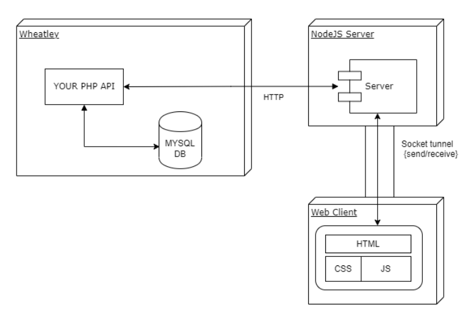
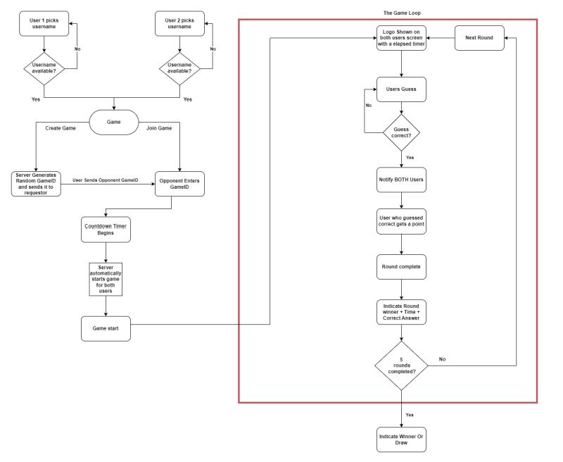

<!-- # <p align=center>Brand Race</p> -->
# Brand Race
---
### CONTRIBUTORS:
- Sizwe - Nickname (Viktor)
- Sello - Nickname (Tebogo)
- Andile - Nickname (Kenmonger)
---
### INTRODUCTION:
- We  will be Implementing `Web Sockets`, We will create a game which will be played in real-time by 2-users per `Game Loop`. This game will be called `BrandRace`. The general idea of the game is to `guess` the logo of a `car brand` quicker than your `opponent`. More details of the game and its rules will be explained below.
- Game Must Contain:
    - A `PHP API` hosted off Wheatley that pulls from a `MYSQL DB`.
    - Random Example, `config.php` Database Connection File.
        ```php
        class ImagesDatabase{
            private $Host = 'localhost';
            private $DatabaseName = 'images_db';
            private $Username = 'username';
            private $Password = 'p@ssw0rd';
            private $initConnection = null;
            // Creating an instance of the ImagesDatabase class
            public static function instance(){
                static $instance = null;
                if ($instance === null){
                    $instance = new ImagesDatabase();
                }
                return $instance;
            }
            // Method for Closing the database connection
            private function close($connection) {
                $connection->close();
            }
            // The Constructor for the ImagesDatabase class
            private function __construct(){
                if ($this->initConnection !== null){
                    if (mysqli_ping($this->initConnection)){
                        $this->initConnection->close();
                    }
                }
                // Initializing the Connection object
                $this->initConnection = new mysqli($this->Host, $this->Username, $this->Password);
                // Checking if Connection was successful
                if ($this->initConnection->connect_error){
                    die("Connection to the Database failed: " . $this->initConnection->connect_error);
                }
                else{
                    $this->initConnection->select_db($this->DatabaseName);
                }
            }
            // The Destructor for the ImagesDatabase class
            public function __destruct(){
                // Check if the connection is still open and close it
                if (mysqli_ping($this->initConnection)){
                    $this->initConnection->close();
                }
            }
            // Getting the Car image and brand_name
            public function getImage($random_number){
                $UserQueryExecution = $this->initConnection->prepare("SELECT image,brand_name FROM race WHERE id = ?");
                $UserQueryExecution->bind_param("i", $random_number);
                $UserQueryExecution->execute();
                $result = $UserQueryExecution->get_result();
                if ($result->num_rows > 0){
                    $row = $result->fetch_assoc();
                    // Do Something
                }
                else {
                    return "No Image Found With ID: " + $random_number;
                }
            }
        }
        ```
    - Random Example: Database Dumb For The `race` Table
        ```sql
        CREATE TABLE IF NOT EXISTS `race` (
            `id` int(11) NOT NULL AUTO_INCREMENT,
            `brand_name`	varchar(255),
            `image`	varchar(255),
            PRIMARY KEY (`id`),
            UNIQUE KEY `brand_name` (`brand_name`)
        ) ENGINE=InnoDB AUTO_INCREMENT=1 DEFAULT CHARSET=utf8mb4;
    - A `local NodeJS socket server` polling your `PHP API` from Wheatley.
    - Random Example. Local NodeJS socket server => `Socket.io`
        ```javascript
        socket.on("joinGame", ({ username, game_loop }) => {
            const user = userJoin(socket.id, username, game_loop);
            socket.join(user.game_loop);
            // Welcome current user
            socket.emit("message", formatMessage(botName, "Welcome to BrandRace!"));
            // Broadcast when a user connects
            socket.broadcast
            .to(user.game_loop)
            .emit(
                "message",
                formatMessage(botName, `${user.username} has joined the game`)
            );
            // Send users and game_loop info
            io.to(user.game_loop).emit("Competitors", {
            game_loop: user.game_loop,
            users: getCompetitors(user.game_loop),
            });
        });
        ```
    - A `Web client` that connects to your `NodeJS socket` server and will act as the `Front End`.
    - Random Example. `index.html`
        ```html
        <!DOCTYPE html>
        <html lang="en">
            <head>
                <title>Brand Race</title>
                <meta charset="UTF-8">
                <meta http-equiv="X-UA-Compatible" content="IE=edge">
                <meta name="viewport" content="width=device-width, initial-scale=1.0">
                <link rel="stylesheet" type="text/css" href="styles.css" crossorigin="anonymous"/>
            </head>
            <body>
                <div class="join-container">
                    <header class="join-header">
                        <h1><i class="fas fa-smile"></i>Brand Race</h1>
                    </header>
                    <main class="join-main">
                        <form action="game_loop.html">
                            <div class="form-control">
                                <label for="username">Username</label>
                                <input type="text" name="username" id="username" placeholder="Enter username..." required/>
                            </div>
                            <div class="form-control">
                                <label for="game_loop">Game Loop</label>
                                <select name="game_loop" id="game_loop">
                                    <option value="game_loop">Game Loop 1</option>
                                </select>
                            </div>
                            <button type="submit" class="btn">Game Loop 1</button>
                        </form>
                    </main>
                </div>
            </body>
        </html>
        ```
- ### LANGUAGE CONSTRAINS:
    - NodeJS
    - JS
    - HTML & CSS (Bootstrap)
    - PHP
- ###### The API and Database should be hosted off Wheatley, the NodeJS server should be hosted locally.
---
- ### ADDITIONAL RESOURCES:
    - ### `NodeJS`:
        - [w3schools](https://www.w3schools.com/nodejs/)
        - [tutorialspoint](https://www.tutorialspoint.com/nodejs/index.htm)
    - ### `ExpressJS`:
        - [tutorialspoint](https://www.tutorialspoint.com/expressjs/index.htm)
        - [expressjs](https://expressjs.com/)
        - [developer.mozill](https://developer.mozilla.org/en-US/docs/Learn/Server-side/Express_Nodejs)
    - ### `Web Sockets`:
        - [developer.mozill](https://developer.mozilla.org/en-US/docs/Web/API/WebSocket)
        - [wikipedia](https://en.wikipedia.org/wiki/WebSocket)
        - [github](https://github.com/websockets/ws)
        - [socket.io](https://socket.io/)
        - [npmjs](https://www.npmjs.com/package/websocket)
    - ### `Base 64`:
        - [w3docs](https://www.w3docs.com/snippets/html/how-to-display-base64-images-in-html.html)
        - [base64](https://www.base64-image.de)
        - [base64decode](https://www.base64decode.org/)
    - ### `DOM Manipulation`:
        - [w3schools](https://www.w3schools.com/js/js_htmldom.asp)
---
- # TASKS:
    - ### Remove `(*)` for Completed Tasks.
    - ### Task 1 - PHP API & DB `(*)`
        - `MySQL` DB
        - Ability to `store` images in the `DB`
        - Ability to `retrieve` images from an `endpoint`
        - The `image(s)` should be random every API Call
        - ReadMe explanation, `1 vs 5` images at a time
        - ReadMe explanation, `Base64` vs `Link`
    - ### Task 2 - Multi-User server `(*)`
        - `Port` can be `chosen`at `run-time`
        - `Reserved Ports` cannot be chosen
        - Server can accept `multiple` clients `simultaneously`
        - `'LIST'` command is implemented and fully functioning
        - `'KILL'` command is implemented and fully functioning
        - `'QUIT'` command is implemented and fully functioning
        - `'GAMES'` command is implemented and fully functioning
        - If `connection` is `closed` on the client the `server closes` the `socket`
        - Server keeps `track` of usernames
        - Server can `detect` When a game should `start` and start the game on the `user` side
        - Server can `send` through `Images` to the client using `sockets` and the `API`
        - Server can `generate` a `unique` `GameID`
        - Server implements the `flow` of the `GameLoop` correctly
    - ### Task 3 - Web Client `(*)`
        - The client can `connect` to a server through a `socket`
        - The client allows the user to `choose` a `username`
        - The client allows user to `enter` OR `generate` GameID `from` the server
        - The client starts the Game Loop on the user side on `cue` from the server
        - Error `Messages`(Username taken, Socket disconnected, Opponent Gets a point, etc.)
        - The ability to implement the Game loop correctly
    - ### Security Requirements Must Be Met!!
---
- ## OVERVIEW:
- ###### To understand the flow of how this all works please consult the diagram below.


---
- ## GAME DETAILS:
    - The aim of `BrandRace`, is to guess a `Car Brand Logo` faster then your opponent. There will be a `total` of `5 rounds`, in each round the players will see a `new` Logo on `screen` and need to `enter` the correct name to get the point, whoever does this the quickest `wins` the round. The `winner` is the player that has won the `most` rounds. However you are also racing against the `clock`, each player will have `limited time` each round and if time runs out before any player guesses the correct logo then `no one` gets the point.
    - To make the game a bit easier to follow please consult the `diagram below`. The Area highlighted in `Red` will be referred to as the `Game Loop` and is referenced throughout the specification. Before the game begins a user `chooses` a `username` and has the option to either `generate` a `GameID` or `enter` in a `GameID`. When a `valid` `GameID` is entered it `automatically` starts the `Game Loop` After a `5 seconds` countdown on both screens.
    - This is a `2 player` game `(1 vs 1)`, if someone else enters in a GameID that is `already in progress` (game started) they `should not` be allowed to join in the game and an appropriate `error message` should be shown.

    

---
- ## INSTRUCTIONS:
    - #### Task 1: PHP API + Database:
        - We will create a PHP API that is hosted off Wheatley as well as a `MYSQL DB` along with it. This `API` should have one endpoint, `GetRandomBrands`. In this endpoint we will choose between returning 5 `random` Car brand logos with their `names` OR 1 `random` Car brand logo with its `name` that should be retrieved from the `MYSQL` Database. There are 2 options when dealing with images. Since images themselves cannot be transferred through an API we will store the images in `Base64` format in the database and return the `Base64 String`. (Consult the resources about working with Base64 at the top of the doc) OR Alternatively we can send through a `link` to the image that is hosted somewhere on the `internet` which we will then display. We will populate the DB `manually` with `PHPMyAdmin` for this assignment. Below is a summary of what is mentioned above:
        - We have 2 options of how we can set up the API. There is no incorrect answer here, We shall motivate our choices
            - `(5 At once)` - This option will return an array of 5 different Car Brand Logos + Names in a single API Call
            - `(1 At a time)` - This option will only return 1 Car Brand Logo + Name at a time
        - We will write a short explanation of our choice and why we believe its the better option. We have 2 Options of how we can transfer images. There is no incorrect answer/choice here, but we need to back up our choice
            - #### `Base64` - We will store images in base64 and decode them client side
                - Encryption method in PHP: `base64_encode()`
                - Encryption method in PHP: `base64_decode()`
            - #### `Link` - Wou will use a link to an external image.
                - `Example`. https://images.pexels.com/photos/63294/autos-technology-vw-multi-storey-car-park-63294.jpeg?auto=compress&cs=tinysrgb&w=1260&h=750&dpr=2
                - `Example Image`:
                - 

        - We will write a `short` explanation of our choice and why we believe its the `better` option.
    - #### Task 2: Multi-User NodeJS server:
        - For this task we will create a `Multi-User` socket server `(on localhost)`. The server will coded in `NodeJS` locally and not off wheatley. We will use `libraries` for this. Note: Wheatley is a web server that follows the `LAMP` stack and installing other applications on it brings security issues. We will therefore use `localhost` for this since the `NodeJS server` needs to run on an open `port` and it would be difficult to allow the server to be run on Wheatley as the chances of multiple people using the same port would be high.
        - #### `The server must have the following functionality`:
            -  Be able to `specify` a port that the `server` will `listen` on at `run-time` (create the socket), using input arguments or prompts. It is good practice to `block` the user from using `reserved` ports (Ports that have been reserved for other task). However there is still a chance we can choose a port in use, but we will just try a different port instead. The ports we will use ports from `1024` to `49151`, make sure the user can only `choose a port in this range`. If you are curious about why this is the case, you can read up about it at https://www.techtarget.com/searchnetworking/definition/port-number.
            - ###### `Definition`: A port number is a way to identify a specific process to which an internet or other network message is to be forwarded when it arrives at a server. All network-connected devices come equipped with standardized ports that have an assigned number. These numbers are reserved for certain protocols and their associated function. Hypertext Transfer Protocol (`HTTP`) messages, for example, always go to port 80 -- one of the most commonly used ports.
        - `Block` the user from attempting to open a Reserved Port (Explained above).
        - Accept `multiple` client connections and interact with the clients `concurrently` through sockets.
        - The server must utilize functionality of the `PHP API` we developed in `Task 1`. That means our server should `contact` our PHP API to get the car brands for the game based on the options we chose.
        - The server should have a `KILL` command to `close` a connection based on their `username`. This also means that we need to keep track of which `socket ID` corresponds to which Username since we need the SocketID to `close` a `socket connection`.
        - The server needs to `account` for `lost` sockets (when a socket was created and the client `[HTML web page]` has `closed/disconnected`). These lost sockets should be closed in order to allow for new connections. If that user was `in a game` then the `game should be stopped` and the other `user` notified (`This check can be done in the game loop`).
        - The server should have a `LIST` command to `list all` the connections it currently has, be sure to list the `usernames` and their respective `SocketIDs`.
        - The server should have a `QUIT` command that `sends` a `broadcast` to all connections notifying that the server will now go `off-line`, thereafter closing all connections.
        - The server should have a `GAMES` command that `shows all games` in `session` or `created`, The `GameID` and the `players usernames`.
        - The server should be able to `keep track`of `usernames`, i.e a when a user requests a username the server `determines` if its `in use`, prompting for a `different username`.
        - The server should be able to `generate` a `Unique GameID`. This should be a random `10` Character `AlphaNumeric` String.
        - The server should be able to start the game loop automatically if a user enters in another users `GameID` (remember the `5 second countdown`).
        - The `Game loop`, Once the game loop has started take note of the following from the `server side`:
            - The server should `notify` the user when the game is `about to start`
            - The server should `keep track` how many `rounds` each user has `won`
            - `Detect` if one `opponent disconnects` and `end` the loop and notify the other
            - The server should be able to implement what is shown in the `Flowchart` under `Game Details`
        - Since Wheatley is password protected, Include login details in the URL as follows:
            - `username:password@wheatley.cs.up.ac.za/uXXXXXXXX/path/to/api`
        - ###### To `test` the functionality of the server will use https://www.piesocket.com/websocket-tester as the client `before` proceeding to Task 3.

    - #### Task 3: Web Client:
        - For this task we will `develop` a `web page/web site` that will `interact` with our `server` (that runs on our local machine `[localhost]`) we wrote for Task 2. The web client must be implemented in `HTML`, `CSS` and `JS` using `Web Sockets`. The client should also be on `localhost`. Note: We will use some client side `library` of our choice `(e.g. WebSockets, Socket.io, etc.)`. To make the changes we can/should make use of `DOM Manipulation` with `javascript`, that way we do not need to `redirect` to a new page every time which might disconnect the socket.
        - #### `The client must have the following functionality`:
            - The user should be able to `enter` in their username. If that username is `not available` then an `error` should be shown, and be `allowed` to enter in a `new username`.
            - After the user has `received` a username they have 2 options
                - `Enter` in a `GameID`. If the GameID `exists` and the game in not im `progress` should `trigger` the game loop.
                - `Generate` a `GameID` (From the server) start the game loop when another user enters in the `GameID`.
            - #### `The Game Loop`
                - Once the server starts the game loop the `screen` should `update` to show the logo with a `elapsed timer`, and the ability for a user to enter in the `brand name`. Here we are free to chose how the user inputs the name.
                - The user should be able to guess the `logo` and be `notified` if they get it `right` or `wrong`(remember this needs to happen in `real-time`). When a user gets it `wrong`, they should be allowed to `try again`, provided their opponent has not got it correct, and `vice versa`.
                - The user should be `notified` if their opponent `gets it right` and what the `correct answer` was before moving onto the next logo. To `aid` user experience use a `countdown` timer `before` moving to the next logo.
            - At the `end` of the game both users should be `notified` of the `winner` unless it was a `draw`.
---
## REQUIREMENTS BEFORE RUNNING THE CODES:

- ### `A text editor`:
    - A text editor is required to create, write and edit code.
    - There are many free and paid text editors available online such as Visual Studio Code, Sublime Text, Notepad++, and Atom.
  - VS Code Instalation Guide: https://www.youtube.com/watch?v=4zVObKFZ6fA&ab_channel=TheCodeholic
- ### `Web server` - Optional (To Test PHP Code And The Database):
    - A web server is required to serve web pages to users.
    - You can use an existing web server like Apache or Nginx, or you can use a package like XAMPP or WAMP which comes with an integrated web server.
    - ##### `Xampp Instalation Guide`:
        - [Windows 10](https://www.youtube.com/watch?v=-f8N4FEQWyY&ab_channel=edureka%21)
        - [Windows 11](https://www.youtube.com/watch?v=VQpATELDSEI&ab_channel=ProgrammingKnowledge2)
    - Once `Xampp` is available:
        - Copy the souce code to the httdoc directory
        - Run `Apache` and `MySQL` server
        - url:  `"http://localhost/path/to/code/login.php"`
- ### `HTML`:
    - Hypertext Markup Language is used to create the structure and content of web pages.
    - You need a text editor to create HTML files with an ".html" extension.
- ### `CSS`:
    - Cascading Style Sheets are used to style the HTML content.
    - You need a text editor to create CSS files with a ".css" extension.
- ### `JavaScript`:
    - JavaScript is used to add interactivity and functionality to web pages.
    - You need a text editor to create JavaScript files with a ".js" extension.
- ### `PHP`:
    - PHP is a server-side scripting language used for dynamic web content.
    - You need a web server that supports PHP to run PHP scripts.
- ### `jQuery`:
    - jQuery is a JavaScript library that simplifies HTML document manipulation, event handling, and animation.
    - You need to include jQuery in your HTML file by linking to it in your code.
    - The Same AJAX Example Using jQuery Just For Control
        ```php
            <!DOCTYPE html>
        <html>
        <head>
            <title>AJAX Example For Control</title>
            <!-- Including jQuery Library in out file -->
            <script src="https://ajax.googleapis.com/ajax/libs/jquery/3.6.0/jquery.min.js"></script>
            <script>
                $(document).ready(function() {
                    $("#exampleButton").click(function() {
                        $.get("URL", function(data) {
                            // DOM Manipulation
                            $("#example_id").html(data);
                        });
                    });
                });
            </script>
        </head>
        <body>
            <h1>AJAX Example For Control</h1>
            <button type="button" id="exampleButton">Load Data</button>
            <p id="example_id"></p>
        </body>
        </html>
        ```
- ### `Web Browsers`:
    - A web browser is necessary to render and display web pages.
    - Popular web browsers include:
        - Google Chrome
        - Mozilla Firefox
        - Safari
        - Microsoft Edge
        - Brave
        - Opera
        - Not Recommended: Tor (Onion Routing)
---
---
